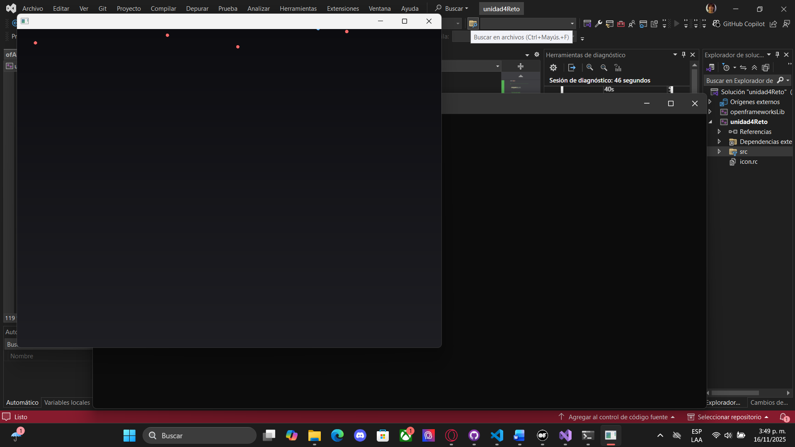
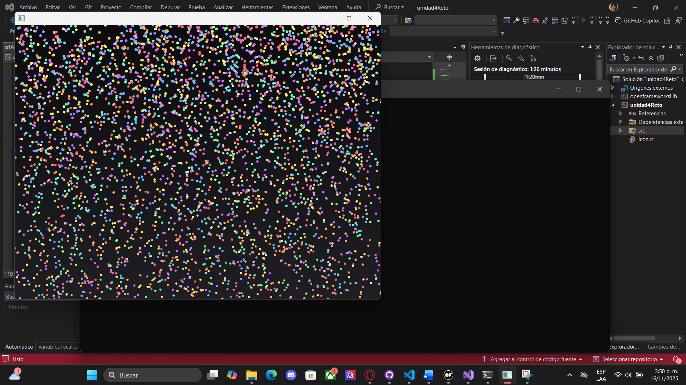
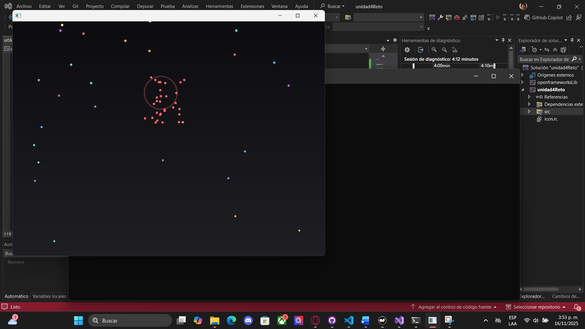

# Reto

### Estructuras usadas:

- Arreglo (palette) para la paleta de colores.

- Lista enlazada (ParticleList) para las partículas/gotas que caen (dinámica continua).

- Pila (BurstStack) para ráfagas interactivas (LIFO) creadas al hacer click.

### Interactividad

- Cuando se oprime c:

En este caso se eliminan las particulas presentes pero se van generando las nuevas.

- Cuando se oprime s:

En este caso se van generando cada vez más particulas.

- Cuando se oprime click (mouse):

### Gestión de memoria:

Todas las partículas y bursts se crean con new y se borran con delete en clear(), en update() cuando caducan, y en los destructores. No hay containers que retengan memoria sin liberar.

### Preguntas guía (respuestas breves para tu bitácora)

1. Exploración creativa:
Quería un efecto de “lluvia interactiva” con ráfagas locales. La lista enlazada es ideal para muchas partículas que entran y salen dinámicamente porque permite inserciones y eliminaciones sin copiar. La pila permite almacenar ráfagas en LIFO (última ráfaga añadida se visualiza más prominente y se quita primero).

2. Gestión de memoria:
Debo asegurarme de delete cada nodo que new. Evité fugas implementando clear() y llamándolo desde destructores y en exit(). También en update() se borran partículas que salen de pantalla.

3. Interacción y dinamismo:
El click produce un efecto visible y modifica simultáneamente la pila y la lista enlazada (nuevas partículas + nuevo burst), generando una respuesta coherente y dinámica.

4. Optimización:

Mantener operaciones O(1) en inserciones y borrados (pushBack con tail y pop con top).

Video: https://youtu.be/Vx40y09JiTQ 