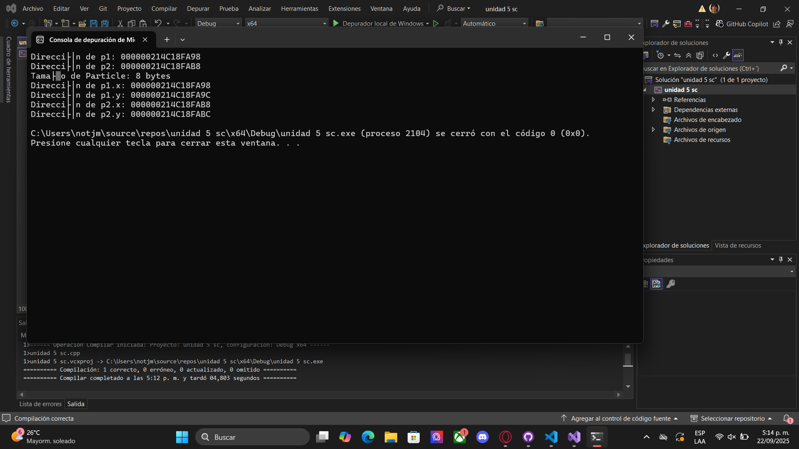

# Sesión 1

## Introducción a los Objetos

### ¿Qué representa la clase Particle?

- Representa una partícula en un plano bidimensional.

- Sus atributos x y y indican la posición de la partícula en los ejes horizontal y vertical.

- Es decir, cada objeto de tipo Particle tendrá su propia ubicación en el espacio.

### ¿Cómo interactúan sus atributos y métodos?

- Los atributos (x y y) guardan el estado actual de la partícula.

- El método move(float dx, float dy) define el comportamiento de la partícula: permite modificar su posición sumando desplazamientos en los ejes X y Y.

## Explorando la memoria

### ¿Los atributos están almacenados de forma contigua?

Generalmente sí: x seguido de y. Pero puede haber espacios de relleno dependiendo de la arquitectura y reglas de alineación.

### ¿Qué indica el tamaño del objeto sobre su estructura interna?

- El tamaño (sizeof) te dice cuánto ocupa un objeto completo en memoria.

- Esto incluye la suma de sus atributos más posibles bytes extra de alineación.

- En clases sin herencia y sin punteros a funciones virtuales, el tamaño es esencialmente el de sus atributos (más padding).

- En clases más complejas (herencia, métodos virtuales), aparecerán punteros ocultos como la vtable, que aumentan el tamaño.

En la imagen se muestra cómo se verían los valores reales de direcciones y tamaños

## Análisis de diferencias

### ¿Cómo afectan los datos estáticos al tamaño de la instancia?

- No lo afectan en absoluto. Los miembros static viven aparte, en la memoria global, y no cuentan dentro del sizeof de la clase.

### ¿Qué diferencias hay entre datos estáticos y dinámicos en términos de memoria?

- Estáticos, se almacenan en memoria global (una copia compartida para toda la clase). No dependen de los objetos.

- Dinámicos, el objeto solo guarda un puntero; los datos reales viven en el heap, y el programador debe gestionarlos con delete. Cada objeto tiene su propia reserva de memoria dinámica si así lo pide.

## Reflexión

### ¿Qué es un objeto desde la perspectiva de la memoria?

Un objeto en C++ puede entenderse como un bloque de memoria que contiene los atributos (datos) definidos en su clase. Cada instancia ocupa un espacio propio en memoria, de forma que sus valores son independientes de los de otras instancias. En este bloque se almacenan únicamente los atributos no estáticos; los métodos y atributos estáticos no forman parte del espacio de memoria reservado al objeto.

### ¿Cómo influyen los atributos y métodos en el tamaño y estructura del objeto?

- Los atributos determinan directamente el tamaño del objeto. Cada atributo aporta su tamaño (por ejemplo, un int normalmente son 4 bytes, un float otros 4 bytes).

- El compilador puede agregar espacios de relleno (padding) para alinear los datos y optimizar el acceso en la memoria.

- Los métodos no influyen en el tamaño del objeto, ya que su código se almacena en la sección de instrucciones del programa. Lo único que se guarda en el objeto son sus datos.

- Los atributos estáticos no se incluyen dentro de cada instancia, sino que se almacenan en memoria global y son compartidos.

- Los atributos dinámicos (punteros) solo ocupan el espacio del puntero dentro del objeto; los datos reales que gestionan viven en el heap.

### Conclusión

Un objeto es esencialmente un contenedor de datos en memoria, cuyo tamaño depende de los atributos que tenga y de las reglas de alineación del compilador. Los métodos y atributos estáticos no afectan el tamaño de las instancias, y los punteros solo representan una dirección, no los datos completos que pueden gestionar.

Este análisis muestra que el diseño de clases no solo es una cuestión lógica, sino también de eficiencia en memoria. Si una clase necesita manejar grandes volúmenes de datos, puede ser mejor usar punteros dinámicos para no inflar el tamaño de cada instancia. Por otro lado, los atributos estáticos son útiles cuando se necesita un valor común sin incrementar el peso de cada objeto. En definitiva, comprender cómo se representa un objeto en memoria ayuda a tomar mejores decisiones de diseño orientado a objetos.

