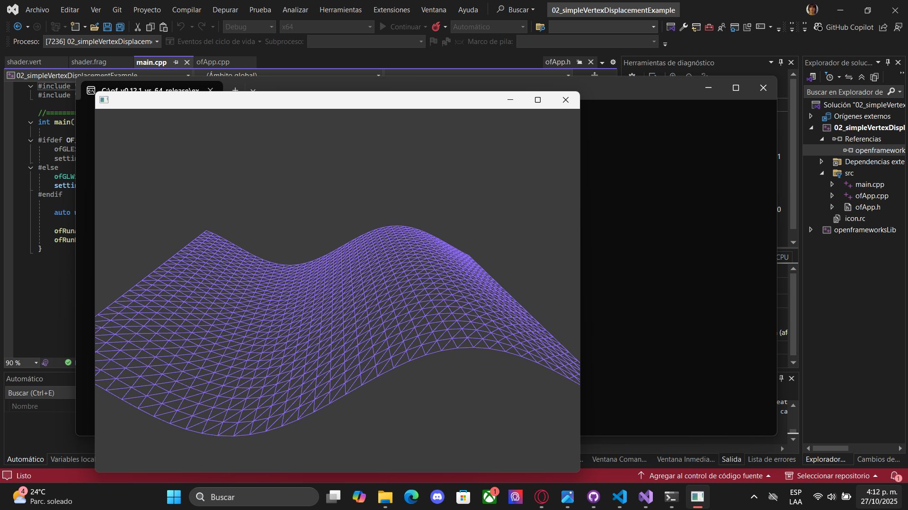

# Actividad 3

1. ¿Qué es un uniform?

Un uniform es una variable que la CPU envía al shader y que mantiene su valor constante durante un dibujo.
Ejemplo: color, tiempo, posición del mouse, etc.

2. ¿Cómo funciona la comunicación entre aplicación y shaders?

La aplicación (CPU) carga el shader en la GPU.

Envía datos mediante uniforms o atributos.

La GPU usa esos datos dentro de los shaders para modificar cómo se dibuja la imagen.

3. Modificación propuesta

            uniform float time;

            void main() {
                vec3 color = vec3(sin(time), cos(time), abs(sin(time * 0.5)));
                gl_FragColor = vec4(color, 1.0);
            }

Esto cambia los colores dinámicamente con el tiempo.

