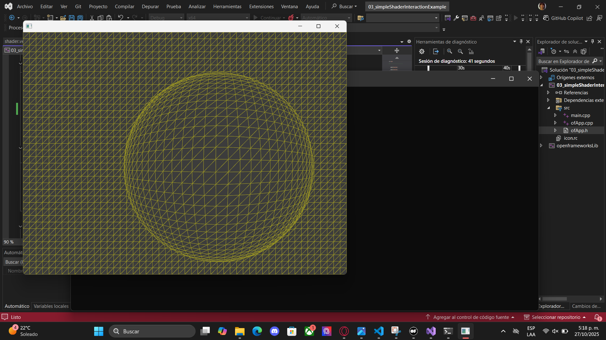

# Actividad 4

1. ¿Qué hace el código del ejemplo?

Permite que los shaders respondan a la interacción del usuario, por ejemplo, al mover el mouse o presionar teclas.
El color o la forma cambian según esos datos.

2. ¿Cómo funciona la comunicación?

La aplicación envía la posición del mouse como un uniform al shader.

El fragment shader usa esas coordenadas para modificar el color o posición de los píxeles en tiempo real.

3.  Realiza modificaciones a ofApp.cpp y al vertex shader para conseguir otros comportamientos.

Se le cambio los colores por medio de ofApp.cpp y también le tamaño de la esfera del curso a una con mayor radio.

Anterior:

    shader.setUniform1f("mouseRange", 150);

    ofFloatColor colorLeft = ofColor::magenta;
    ofFloatColor colorRight = ofColor::blue;

Ahora:

    shader.setUniform1f("mouseRange", 300);

    ofFloatColor colorLeft = ofColor::darkRed;
    ofFloatColor colorRight = ofColor::greenYellow;

4. Realiza modificaciones al fragment shader para conseguir otros comportamientos.

se le agregó:

    uniform float time;
    uniform vec2 mouse;
    uniform vec2 resolution;

    void main() {
        vec2 uv = gl_FragCoord.xy / resolution;
        float d = distance(uv, mouse / resolution);
        vec3 color = vec3(sin(time + d * 6.0), cos(time + d * 3.0), sin(time));
        gl_FragColor = vec4(abs(color), 1.0);
    }

Con la intención de tener una animación en el color con el tiempo y con la reacción al mouse.

